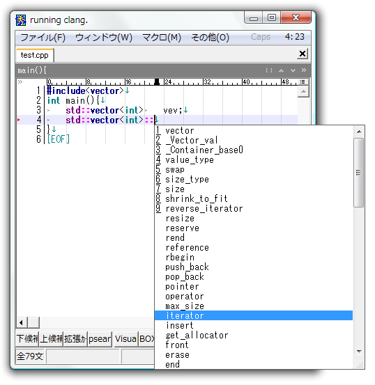

# clangでキーワード補完する秀丸マクロ

# 動作確認した環境
秀丸エディタ v8.03

# 詳細
詳細は日記の方に記載しています
http://d.hatena.ne.jp/ohtorii/20110319/1300514225

# 連絡先

https://twitter.com/ohtorii  
http://d.hatena.ne.jp/ohtorii/   
https://github.com/ohtorii/clang_examples_visual_studio/   
